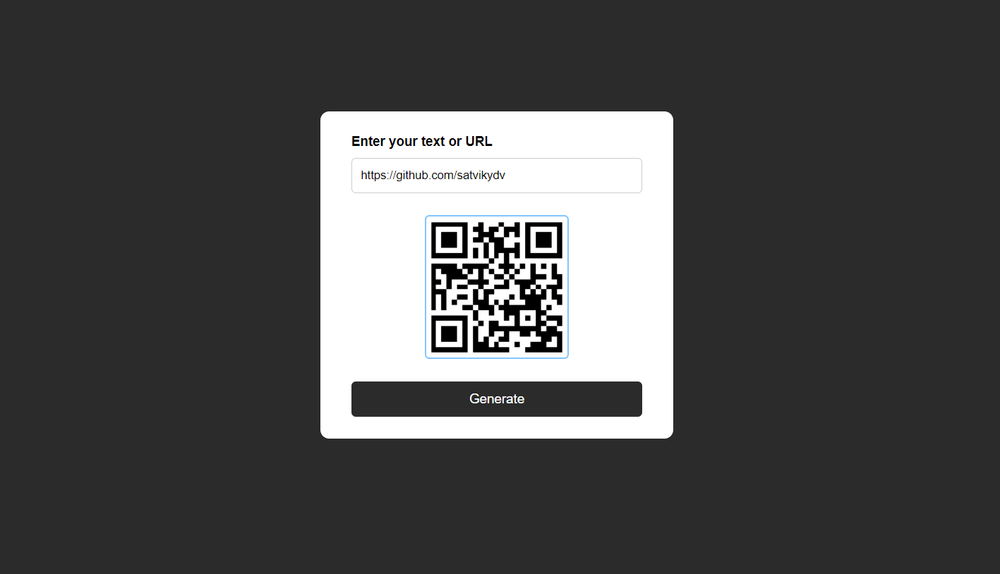

# QR Code Generator

A simple QR Code Generator built with HTML, CSS, and JavaScript. This web application allows users to generate QR codes for any input text or URL.

## Features

- Generate QR codes from any text or URL.
- Simple and user-friendly interface.
- Copy the generated QR code to the clipboard.
- Download the generated QR code as an image.

## Screenshots



## Getting Started

### Prerequisites

To run this project locally, you need a modern web browser and an internet connection.

### Installation
1. Clone the repository:

   ```bash
   git clone https://github.com/your-username/qr-code-generator.git

2. Navigate to the project directory:
    ```bash
    cd qr-code-generator
    
3. Open index.html in your web browser:

## Usage

1. Enter the text or URL you want to generate a QR code for in the input field.
2. Click the "Generate QR Code" button.
3. The generated QR code will be displayed on the screen.
4. You can copy the QR code or download it as an image.
